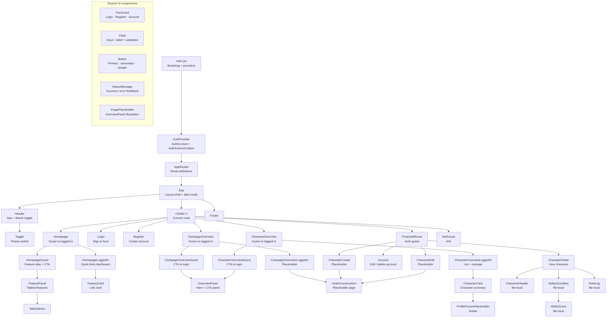

# Sheet Herder

Sheet Herder is a TTRPG companion app for managing D&D characters and campaigns. This repository is the React frontend — a prototype built to explore and demonstrate the frontend technologies taught in the 3rd semester of the Datamatiker programme at Erhvervsakademi København. The focus is on learning and applied use of technology, not on a finished product.

[Video demo](https://youtu.be/fA4ZswHFNVg) · [Live app](https://sheet-herder.dhangaard.dk) · [Portfolio](https://dhangaard.dk) · [Backend API](https://sheet-herder-api.dhangaard.dk/api/v1/) · [Backend Repository](https://github.com/dhangaard/sheet-herder-api)

---

## Features

- Register and log in with JWT authentication
- View characters with ability scores, race, and languages sourced from the D&D 5e API
- Append and delete timestamped notes on individual characters
- Dark mode with system preference detection
- Distinct guest and logged-in views throughout

---

## Tech stack

| | |
|---|---|
| Framework | React 19 + Vite |
| Routing | React Router v7 |
| Styling | CSS Modules + CSS custom properties |
| Auth | JWT stored in `localStorage` |
| HTTP | Native `fetch` via shared `apiClient.js` |
| Icons | `vite-plugin-svgr` (SVG as React components) |

---

## Architecture

Pages orchestrate data and state, components are reusable and receive props only, and services own all HTTP communication. Auth state is split across two React Context objects — `AuthContext` for reading state and `AuthActionsContext` for triggering mutations — so components that only need to read do not re-render on action changes.

```
src/
├── components/     # Reusable UI components
├── context/        # Auth context (split into authContext, AuthProvider, useAuth)
├── hooks/          # Custom hooks
├── pages/
│   ├── homepage/   # HomepageGuest / HomepageLoggedIn
│   ├── character/  # CharacterOverviewGuest / CharacterOverviewLoggedIn / CharacterDetail
│   ├── campaign/   # CampaignOverviewGuest / CampaignOverviewLoggedIn
│   └── user/       # Login / Register / Account
├── services/       # HTTP clients — one file per resource
├── styles/         # Global CSS (reset, variables, typography, layout)
└── utils/          # Pure helper functions
```

---

## Component tree



---

## Deployment

The app is built as static files via `vite build` and served by Caddy on a DigitalOcean droplet. Deployments trigger automatically on push to `main` via GitHub Actions.

---

## Contributors

**Daniel Hangaard**  
cph-dh258@stud.ek.dk  
[github.com/DHangaard](https://github.com/DHangaard)

---

## License

The source code in this repository is licensed under the MIT License.
See the [LICENSE](./LICENSE) file for details.

**Note:** The project name, logo, and visual identity are **not** included under the MIT License.
Please refer to [BRANDING.md](./BRANDING.md) for usage guidelines and copyright information regarding these assets.
